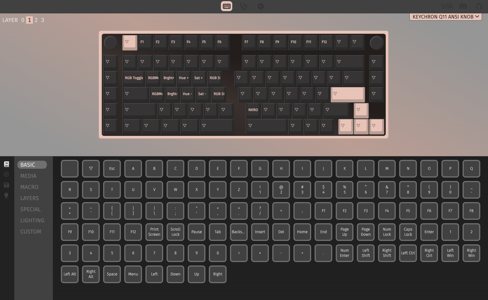

# VIA setting file

## Getting Started

First of all, you should go to the VIA website.
https://usevia.app/

- VIA is the best keyboard firmware for custom mechanical keyboards.
- Keychron is supported by VIA.

## What should we use VIA site for ?

- You can use VIA site to customize your keyboard.
- The customization config is installed on your keyboard. Therefore, you can use the config across multiple devices.
- No longer we need karabiner-elements or qmk-toolbox.
- The setting is defined in json format.
- This directory is where you can store your json files.

